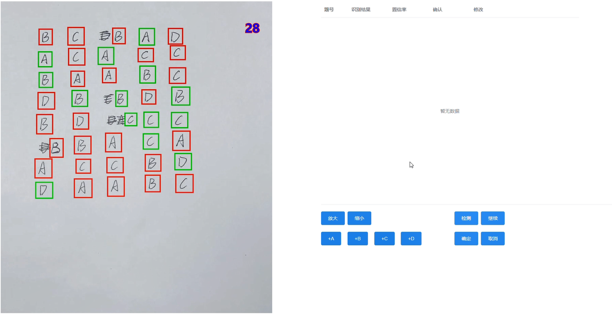
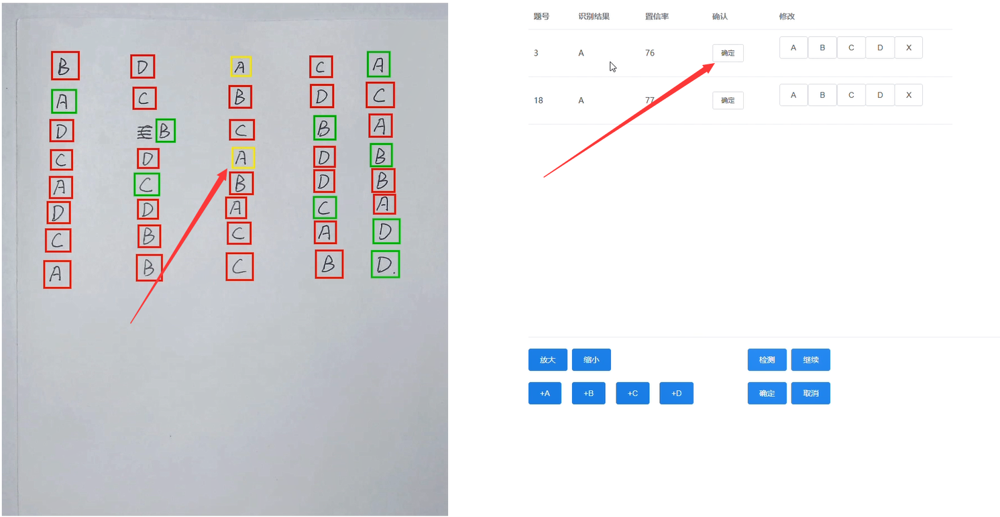
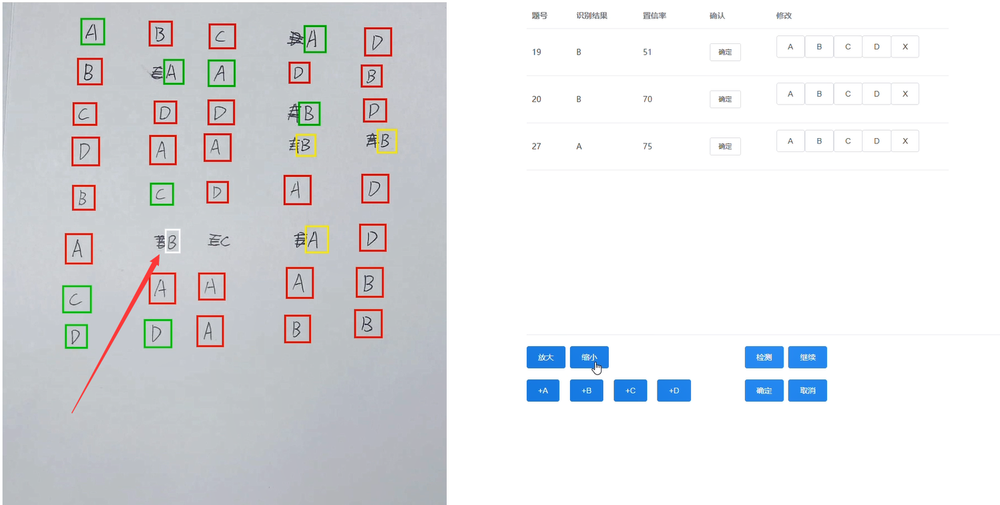

# 字符检测系统-前端
  [字符检测系统-后端](https://github.com/khuqen/letters_detect_backend)

## 概述
字符识别系统(可检测A、B、C、D、X)五类目标，用于试卷的选择题部分的修改。有如下的功能：
- 检测视频的放大和缩小
- 识别目标，根据识别结果绘制边框，正确绿色，低置信率黄色，错误红色
- 人工确认低置信率目标
- 人工绘制添加目标
- 标注排序结果和正确答案

界面如下(非最新界面)







## Project setup

```
npm install
```

### Compiles and hot-reloads for development
```
npm run serve
```

### Compiles and minifies for production
```
npm run build
```

### Lints and fixes files
```
npm run lint
```
